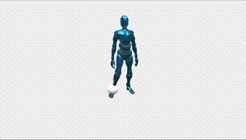

# 3D Animation Samples

A project with some examples of animations techniques applied in Unity

## Topics

* 01 - Animating With Physics
* 02 - Local and World Positions
* 03 - KeyFrames and Curves
* 04 - States and Transitions
* 05 - Walk-Idle Controls
* 06 - Rig Types (Generic and Humanoid)
* 07 - Root Motion and Humanoids
* 08 - Root Motion to Create a Dance Sequence
* 09 - Drive Script With Root Motion
* 10 - Trigger Animations With Colliders
* 11 - Trigger Animation By Clicking
* 12 - Jump and Climb
* 13 - BlendShapes
* 14 - BlendShapes For Facial Animation
* 15 - Strafes Set (Blend Trees)
* 16 - IK For Manipulate Joints
* 17 - IK To Look At An Object
* 18 - IK To Pick An Object
* 19 - Final Project

### Instructions

Use "E" key to go to the next scene, and "Q" key to go to the previous scene. Each scene has its own instruction Canvas (if needed)